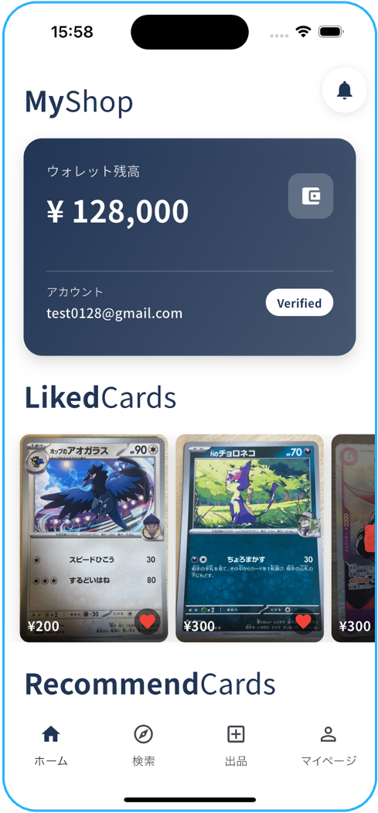
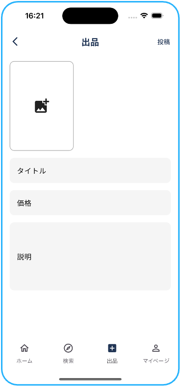
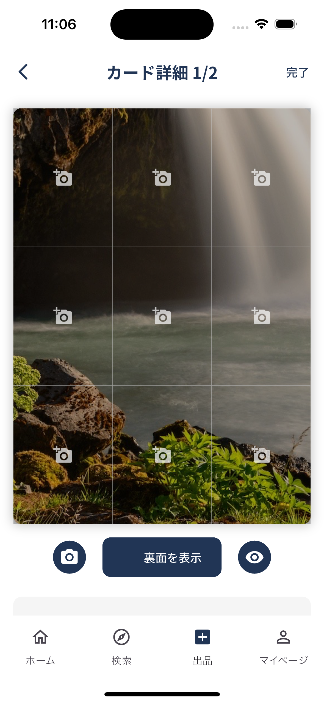
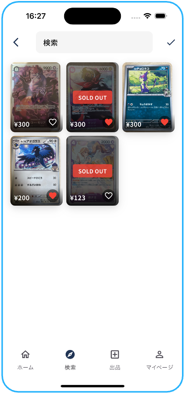
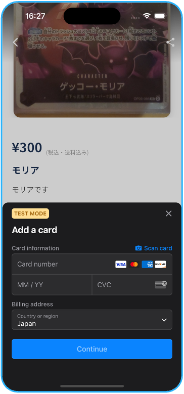
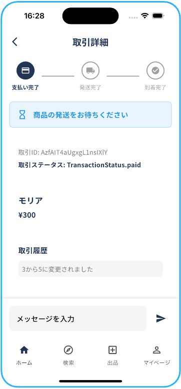

# トレーディングカード取引プラットフォーム

## 📱 プロジェクト概要
トレーディングカードの安全な取引を実現するプラットフォームアプリケーション。
高精細な画像による状態確認、Stripe決済による安全な取引、本人確認システムを統合したワンストップサービスです。

## 🎯 開発の動機
- トレーディングカード取引における詐欺被害の防止
- カードの状態を正確に確認できる取引環境の実現
- 安全な決済と個人情報保護の両立
- カードゲームの「楽しさ」をデジタル空間で再現

## 🛠 技術スタック
### フロントエンド
- Flutter/Dart
- Riverpod（状態管理）
- Auto Route（画面遷移）
- MVVMアーキテクチャ

### バックエンド
- Firebase Authentication
- Cloud Firestore
- Cloud Storage
- Cloud Functions (Node.js)

### 決済システム
- Stripe Connect

## 🔍 特徴
### 取引に用いるカードモデル
```dart
class CardModel {
  final String id;
  final String mainImageUrl;
  final String? backImageUrl;
  final List<CardDetailImage> frontDetailImages;
  final List<CardDetailImage> backDetailImages;
  final String condition;
  final DateTime createdAt;

  CardModel({
    required this.id,
    required this.mainImageUrl,
    this.backImageUrl,
    required this.frontDetailImages,
    required this.backDetailImages,
    this.condition = '',
    required this.createdAt,
  });
}

class CardDetailImage {
  final String id;
  final CardArea area;
  final String imageUrl;
  final String? description;
  final DateTime createdAt;

  CardDetailImage({
    required this.id,
    required this.area,
    required this.imageUrl,
    this.description,
    required this.createdAt,
  });
}
```

## 📲 アプリの利用フロー

当プラットフォームを通じたトレーディングカードの取引は、以下の流れで安全かつスムーズに行えます。

### 1. メイン画面での商品閲覧
ホーム画面では様々な情報を閲覧できます。



### 2. カード出品機能
高精細な画像をアップロードし、詳細な状態を記録できます。



### 3. カード詳細
代表画像に加え、9枚の詳細画像を撮影することで、エッジやコーナー部分の細かい傷も正確に伝えられます。



### 4. 商品リスト表示
商品はリスト形式で見やすく表示され、欲しいカードを素早く見つけられます。



### 5. 安全な決済システム
Stripe Connectを利用した安全な決済システムを実装しています。



### 6. 取引管理
購入した商品の取引を進行します。



## 📈 開発状況
現在の実装済み機能：
- ユーザー認証
- Stripe Connect統合
- 商品出品機能
- 決済処理
- 取引履歴管理

## 🔒 セキュリティ対策
- Stripe本人確認システム
- Firebase Authentication
- 取引情報の暗号化
- 画像の安全な保存

## 🎨 アーキテクチャ
```
project/
├── lib/
│   ├── models/        # データモデル
│   ├── providers/     # 状態管理
│   ├── ui/           # 画面実装
│   │   ├── home/     # ホーム画面
│   │   ├── product/  # 商品詳細
│   │   └── profile/  # ユーザー情報
│   └── utils/        # ユーティリティ
└── functions/        # Cloud Functions
```

## 🔜 開発予定機能
1. AIによる画像解析機能
   - エッジ検出によるカード状態評価
   - 真贋判定システム
2. チャット機能
3. 配送追跡システム
4. ユーザーレーティングシステム

## 📱 動作環境
- iOS 13.0以上
- Android 8.0以上
- Flutter 3.0以上

このプロジェクトは現在も活発に開発を続けており、新機能の追加やパフォーマンスの改善を継続的に行っています。
